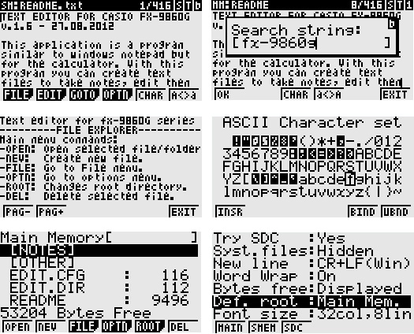

# TEXT EDITOR FOR CASIO FX-9860G
Text editor for casio FX-9860G (v.1.6 -- 27.08.2012)

This application is a program similar to windows notepad but for the
calculator. With this program you can create text files to take notes,
edit them or just view them on the calculator. Afterwards, you can
download to the PC files created or upload new ones. The program is able
ro read and write files in the main memory, storage memory or SD card.

These are the main features of the application:

-   Text editor with changeable font size. You can edit text in the
    standard 21 lines x 8 columns font, or 32 columns x 10 columns font,
    plus other two in the middle.

-   Integrated file explorer for rename, copy, move o delete files in
    main memory, storage memory or SD card.

-   Integrated help screen.

-   Text edition functions: clip,copy,cut,paste

-   Word wrap feature

-   Search string within text

-   Insert any ASCII char not accesible by the keyboard.

-   Customize up to 20 character bindings on the keyboard after pressing
    VARS key

-   Setup screen to customize several options.

The text editor for casio fx-9860g and its source code is provided under
the GNU / GPL license. Please, find the contents of the license in the
file license.txt.

# Text files / Binary files

Only text files can be edited. If files that contain characters outside
of the \"text\" range (below ascii 32), file will be opened in binary
mode. In this case you can not modify the file, unless you save it with
another name. This feature prevents system files to be modified by
accident.

# Memory considerations

Up to 40Kb files can be edited due to available memory in the system. If
larger files are loaded only the first 40Kb will be displayed. If the
file is saved then, the part after the 40Kb will be lost. However, the
maximun allowed size for files can be changed with set up parameter
\"text buffer size\". Maximum available is 40Kb.

There are four set up parameters related to memory configuration that
are important to understand:

-   Text buffer size

-   Clipboard buffer size

-   Files/Dir.

-   Foldr.Max.

These parameters reserve memory internally in the application for work
buffers, and not all posible combinations for them work. If, for
example, you set 40Kb for the text buffer, you will not be able to set
maximun values in the other parameters as well, because there will not
be enough memory left. When this happens a popup window will warn the
user that there was not enough memory for a buffer, and that it was set
up to minimum size. You must restart application afterwards, and try
another parameter configuration.

An optimum combination of these parameters could be the following:

-   Text buffer size = 32Kb

-   Clipboard buffer size = 2Kb

-   Files/Dir. = 128

-   Foldr.Max. = 64

but other choices are posible depending on to your needs and available
memory.

The configuration settings are stored in a main memory file:
\<@EDIT\>/EDIT.CFG. You can see this file wit the memory explorer in the
calculator. If the file is deleted or lost by accident it is no problem
at all. The configuration file will be created with default values the
next time the editor is started.

# Files in main memory

The application is able to read and write files in main memory but these
considerations must be taken into account:

-   Casio did not provide any C function in the SDK to access the
    directory structure of the files in main memory. This limitates the
    files that can be accessed with the application.

-   Addin applications have their own folder in main memory to store
    files. In this case folder name is \<@EDIT\>, because addin name is
    EDIT.g1a. The text editor can only access files inside this folder
    but not outside. The reason is because the directory structure has
    is generated inside file \<@EDIT\>/EDIT.dir. This file contains the
    directory structure of the files in main memory that can be seen by
    the text editor.

-   If you place files inside folder \<@EDIT\> with the built-in memory
    manager or with the FA-124 program, the file EDIT.dir will not be
    updated, and when you start the text editor these files will not
    appear. If you want to put or delete files in folder \<@EDIT\> use
    always the text editor; otherwise the directory structure in
    EDIT.dir will not be syncronized.

-   If the file EDIT.dir gets damaged of lost you will not loose your
    files. The text editor will not show any file in main memory area
    but files are still there. You can check your files with the memory
    manager. To generate the contents of the file EDIT.dir, if it is
    lost, follow these two steps: 1 -- Open memory manager and move all
    files in folder \<@EDIT\> to the storage memory but file EDIT.dir
    must be deleted from this folder if present, file EDIT.cfg must be
    kept. 2 -- Open the text editor and move the previous copyed files,
    from the storage memory to the main memory. Directory will be
    generated again.

-   It is also possible to create folders in main memory with the text
    editor. However, you must know that the operating system does not
    allow to create sub-folders within folders. All files in main memory
    are inside folder \<@EDIT\>, the creation of any sub-folder here is
    not posible with the operating system, but the text editor simulates
    sub-folders because the directory structure is written to file
    EDIT.dir. You will see the sub-folders in the text editor but if you
    check the memory manager sub-folders will not appear, because they
    do not exist at operating system level.

-   Because folders in main memory are simulated you must know that two
    files that have the same name but that are stored in different
    folders will be the same from the operating system perspective. You
    can organize your files in folders but the file name must be unique
    always. The operating system does not recognize subfolders.

#  Character bindings

The ASCII character set screen, when opened from the text editor window,
shows the buttons BIND and UBND. With the use of these two buttons you
can bind ASCII characters to specific keys on the keyboard. The defined
bindings will be used in the editor window when the VARS key is used.
The user must press on the VARS key and then defined key to call the
bound character. Up to 20 character bindings can be defined.

# 

# Change log

Changes to the previous version 1.51

-   ASCII character binding functionality added.

-   Bugfix: Menu strange behaviour after pressing EXIT key several
    times, fixed.

Changes to the previous version 1.5

-   Bugfix: Clipboard buffer is not deleted if you copy text from one
    file and paste it into another one.

Changes to the previous version 1.4

-   File explorer is shown when the application is started instead of
    the text editor window. I made this because standard casio
    applications usually show file list first and then file contents. I
    wanted to make the program more casio-like.

-   Menus re-organized. Functions like OPEN and NEW were removed from
    text editor window and were made available only from file explorer.

-   Two new functions added to create and delete folders from file
    explorer.

-   Added functionality to read and write files/folders in main memory
    (Only inside folder \<@EDIT\>.

-   Keys SHIFT+CLIP and SHIFT+PASTE are equivalent to the same functions
    in the menus.

-   Limitation that considered files as binary ones if characters were
    over ascii 127 was removed. Files are considered to be binary if
    chars below ascii 32 are found.

Changes to the previous version 1.31

-   Function pointers added to customize special menu node printting (to
    save memory).

-   Bugfix in GOTO-END command, it did not work at last file line.

-   New buffers used for file & folder directories.

-   Two new configuration options to set maximum files per directory and
    maximum total number of folders.

-   Search string & get file name popups now show keyboard status
    (1/S/a/A/b/B).

-   Added two buttons in menubars of search string & get file name
    popups to change case and to insert special characters.

Changes to the previous version 1.3

-   Bugfix in file copy & move. Calculator hangup most probably due to
    stack overflow.

Changes to the previous version 1.2

-   Word wrap feature. New configuration option to enable/disable this
    feature.

-   Two new commands in GOTO menu for cursor movement: Home & End.

Changes to the previous version 1.1

-   New configuration option to display cursor instead of folder in the
    topbar.

-   Number of files limit checked while reading directories

-   Memory status screen does not check SD card if try SD option is
    false.

-   Memory buffers freed in QuitHandler function.

-   Incorrect text limit check fixed when pasting text.

Changes to the previous version 1.0

-   Function SetQuitHandler() used to give the chance to the user to
    save the file if the application is quit (if you hit menu key and
    execute another application).

-   Size of text buffer and clipboard buffer are changeable from setup
    menu. It is no longer limited to 16Kb but up to 40Kb can be used to
    edit files. By default they are set to a minimum size (4Kb and 1Kb),
    to ensure that the text editor starts propperly. Aftewards you can
    resize the buffers in the setup menu. To see the changes in the
    buffers you must terminate application and execute it again.

-   New option added in HELP menu (that was renamed to OPTN menu) to
    display the available memory in the system.

#  Function reference

## [FILE EXPLORER]{.underline}

Main menu commands:

-   OPEN: Open selected file/folder

-   NEW: Create new file.

-   FILE: Go to File menu.

-   OPTN: Go to options menu.

-   ROOT: Changes root directory.

-   DEL: Delete selected file.

File menu commands:

-   REN: Rename file.

-   COPY: Copy file.

-   MOVE: Move file.

-   NEWF: Create new folder.

-   DELF: Delete selected folder.

Options menu commands:

-   OPTN: Enter set up screen. Set up screen is also called with
    Shift+SETUP.

-   MEM : Display memory status.

-   HELP: This help screen.

-   ABOU: Information about program

Root menu commands:

-   MAIN: Change to main memory as root directory.

-   SMEM: Change to storage memory as root directory.

-   SDC: Change to SD Card as root directory.

### TEXT EDITOR

Main menu commands:

-   FILE: Go to file menu.

-   EDIT: Go to edit menu.

-   GOTO: Go to goto menu.

-   OPTN: Go to options menu.

-   CHAR: ASCII character set.

-   A\<\>a: Change upper/lower case.

File menu commands:

-   SAVE :Save file to current location memory.

-   S.AS: Save file with different file/folder names.

-   AUTO: Set current file to be opened automatically when program
    starts.

Edit menu commands:

-   CLIP: Text selection on / off. Same as SHIFT+CLIP.

-   COPY: Copy text to clipboard.

-   CUT: Copy text to clipboard and delete.

-   PAST: Paste text from clipboard. Same as SHIFT+PASTE.

-   DEL: Delete selected text.

-   SRC: Search string within text

-   SRC+: Search again.

Goto menu commands:

-   TOP: Move cursor to beginning.

-   BOTM: Move cursor to ending.

-   HOME: Go to begining of line.

-   END: Go to ending of line.

-   PAG-: Page up.

-   PAG+: Page down.

Options menu commands:

-   OPTN: Enter set up screen. Same as SHIFT+SETUP.

-   MEM: Display memory status.

-   HELP: This help screen.

-   ABOU: Information about program

ASCII character set commands:

-   INSR: Inserts character into text.

-   BIND: Binds character to key.

-   UBND: Unbinds character.

Bound characters are used in the editor window by pressing VARS key and
then the key defined for the bound character.

Information in the top bar:

-   MM/SM/SD: Root directory.

-   File name.

-   Folder or Cursor.

-   S/-: File saved flag

-   T/B: Text file / Binary file

-   1/S/a/A/b/B:Keyboard mode: (1) Numeric, (S) Shift, (a) Alpha
    lower, (A) Alpha upper,(b) Alpha locked lower, (B) Alpha locked
    upper.

### SET UP

Try SDC:

-   YES: card is checked everytime the file explorer is called.

-   NO: card is not tried never. Use this option if your calc does not
    have SD card because file explorer opens faster.

System Files:

-   HIDN: System files are hidden in the file explorer. System files are
    \*.g1? and those in which attribute is not DT_FILE or DT_DIRECTORY.
    Files EDIT.CFG and EDIT.DIR are system files.

-   DISP: System files are displayed in the file explorer.

New Line:

-   WIN: Files are stored using CR+LF as line terminator as in windows
    systems.

-   UNIX: Files are stored using LF as line terminator as in unix
    systems.

Word Wrap:

-   ON: Line breaks happen in between of words, no cuts in in the middle
    of words.

-   OFF: Line breaks happen anywhere, words are cut in between.

Bytes free:

-   YES: Remaining memory is displayed in last row of file explorer.

-   NO: Remaining memory is not displayed.

Default root directory:

-   MAIN: Set main memory as root when file explorer opens.

-   SMEM: Set storage memory as root when file explorer opens.

-   SDC: Set SD Card as root when file explorer opens.

Font size:

-   TINY: Set font size to 3x5. 32 columns x 8 rows.

-   SMAL: Set font size to 3x6. 32 columns x 7 rows.

-   MEDM: Set font size to 3x6. 25 columns x 7 rows.

-   LARG: Set font size to 5x7. 21 columns x 6 rows.

Info Bar:

-   FOLD: Folder name is displayed in the top bar.

-   CURS: Current line and total lines are displayed in the top bar.

Text buffer size:

This option sets the size of the buffer used to load the files. It is
maximun file size that an be loaded in the text editor.

Clipboard buffer size:

Size of the clipboard buffer. It is the maximun data that you can and
copy and paste.

Files/Dir.:

This is the maximun number of files per folder that can be displayed in
the file explorer

Foldr.Max.:

This is the maximun number of folders that can be displayed in the
folder selection window.

Auto open:

-   YES: Enable automatic file open when application starts.

-   NO: Disable automatic file open

Auto root/Auto name/Auto foldr.:

-   SET: Set path for file to be opened automatically.

-   CLR: Clear file path.

This program was developed from August 2008 to April 2009 by Diego
Marin. Report any bugs or comments to: diegomarin75@gmail.com
